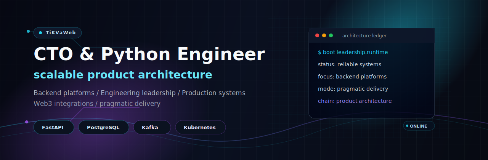

<p align="center">
  
</p>

<h1 align="center">TiKVaWeb</h1>

<p align="center">
  <strong>CTO &amp; Python Engineer focused on scalable product architecture</strong>
</p>

<p align="center">
  I build backend platforms, lead engineering teams, and turn product complexity into reliable production systems.
  My core stack is Python, FastAPI, PostgreSQL, distributed messaging, Kubernetes, and pragmatic CI/CD.
</p>

<p align="center">
  <a href="https://t.me/TiKVa_dev">
    
  </a>
  
</p>

---

### Core Focus

<table>
  <tr>
    <td width="50%">
      <strong>Backend Architecture</strong><br />
      Designing APIs, services, data flows, and boundaries that stay maintainable under real product pressure.
    </td>
    <td width="50%">
      <strong>Product Engineering</strong><br />
      Building production features with a clear path from business requirements to shipped systems.
    </td>
  </tr>
  <tr>
    <td width="50%">
      <strong>Engineering Leadership</strong><br />
      Leading teams, setting technical direction, improving delivery process, and keeping architecture practical.
    </td>
    <td width="50%">
      <strong>Web3 Integrations</strong><br />
      Working with wallet flows, transaction-oriented products, external integrations, and reliability-sensitive domains.
    </td>
  </tr>
</table>

### Tech Stack

<p>
  
  
  
  
  
  
  
  
  
</p>

```txt
runtime.focus = ["backend-platforms", "product-architecture", "team-leadership"]
stack.core    = ["Python", "FastAPI", "PostgreSQL", "Redis", "RabbitMQ", "Kafka"]
delivery.mode = "reliable systems, pragmatic architecture, clean execution"
```

### Selected Work

<table>
  <tr>
    <td width="50%">
      <strong>Large-scale education platform</strong><br /><br />
      Backend and platform architecture for an education product with complex user flows, service integrations,
      operational reliability requirements, and long-term maintainability needs.
    </td>
    <td width="50%">
      <strong>Crypto wallet / Web3 product</strong><br /><br />
      Wallet-oriented product engineering with transaction flows, integration-heavy backend logic,
      security-minded architecture, and production operations.
    </td>
  </tr>
</table>

### GitHub Signal

<p align="center">
  
  
</p>

<p align="center">
  
</p>

<p align="center">
  
</p>

### Operating Principles

```txt
01. Make the architecture clear before scaling the implementation.
02. Prefer simple boundaries, explicit contracts, and measurable reliability.
03. Build teams and systems that can ship without chaos.
04. Keep delivery practical: production value beats decorative complexity.
```

---

<p align="center">
  <strong>Open to technical conversations, architecture reviews, and product engineering collaboration.</strong><br />
  Telegram: <a href="https://t.me/TiKVa_dev">@TiKVa_dev</a>
</p>
